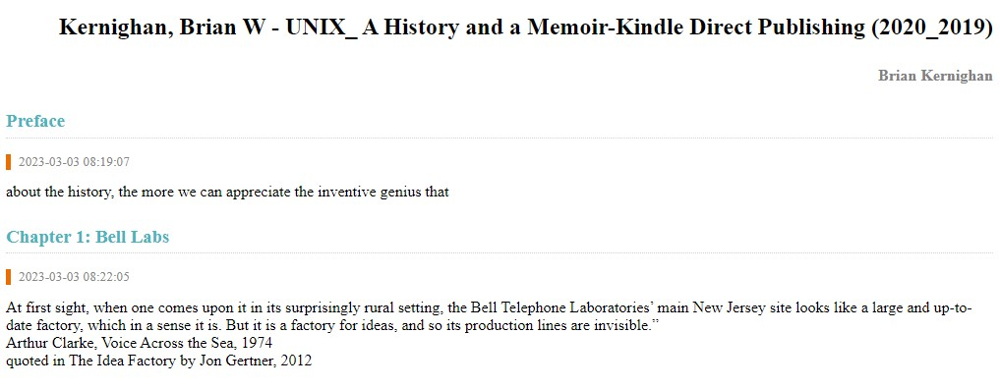
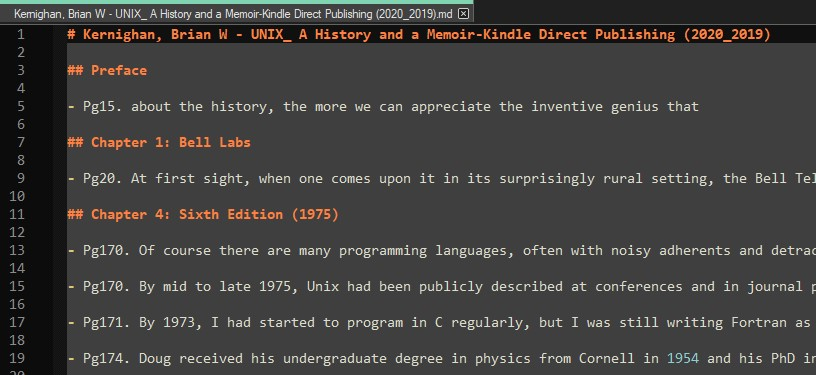

# Boox Annotation Formatting

This repository contains a Python script and a batch file for processing `.txt` or `.html` annotations shared from a Boox device.

## Introduction

The Boox Annotation Processing repository provides a simple solution for processing Boox annotations. It allows you to convert the annotations into a formatted output that can be easily imported into note-taking and personal knowledge base (PKB) applications like [Obsidian](https://obsidian.md/).

By default, 'shared' Boox annotations can be exported in `.txt` or `.html` format to Google Drive, OneNote, EverNote, or to another app installed on your Boox device by  navigating to `Contents > Annotations > Share` in NeoReader. 

### .txt Annotations
The exported `.txt` annotations look like this:


This is a bit messy and contains a lot of information that I don't find useful. The Boox Annotation Processing script converts the annotations into a more readable format that looks like this:


And which we can then copy into note-taking software such as Obsidian to look like this:


### .html Annotations
The exported `.html` annotations look like this:



And similarly, the Boox Annotation Processing script converts the annotations into a more readable format that looks like this:




## Files

1. `boox_annotation_processing.py`: This is the main Python script that processes the Boox annotations.
2. `run_script.bat`: This is a batch file for running the Python script with specific input and output parameters.

## Requirements

- Python 3.x
- Windows OS (for the batch file)

## Installation

1. Install Python 3.x if it is not already installed on your system. You can download Python from the official website: [python.org](https://www.python.org/downloads/).

## Setup

1. Clone or download this repository to your local machine.
2. Install Regex by running `pip install regex` or `conda install regex` in the command line.
2. Install BeautifulSoup by running `pip install beautifulsoup4` or `conda install beautifulsoup4` in the command line.
3. If running through the batch file, configure the batch file as described in the [Usage on Windows](#usage-on-windows) section below.

## Usage on Windows

The easiest way to run the script is to use the batch file `run_script.bat`. The batch file takes two command line arguments:

- `input_dir`: The path to the directory containing the Boox annotations in `.txt` or `.html` format.
- `output_dir`: The path to the directory where the formatted `.md` files will be saved.

Here is an example of how to configure the batch file to output directly to an Obsidian vault:

```bat
SET input_dir="C:\Users\Username\Google Drive\Books\Exported Boox Annotations"
SET output_dir="C:\Users\Username\Obsidian Vault\Books\Boox Annotations"

python boox_annotation_processing.py %input_dir% %output_dir%
```

After configuring the batch file, navigate to the `src` directory containing the Python script and batch file (using the command `cd "C:\Users\Username\GitHub\boox-annotation-processing\src"`, for example). Then run the script using the command:
```bash
run_script.bat
```

## General Usage

You can run the Python script directly from the command line by navigating to the directory containing the repository and using the command:
```bash
python boox_annotation_processing.py <input_dir> <output_dir>
```


